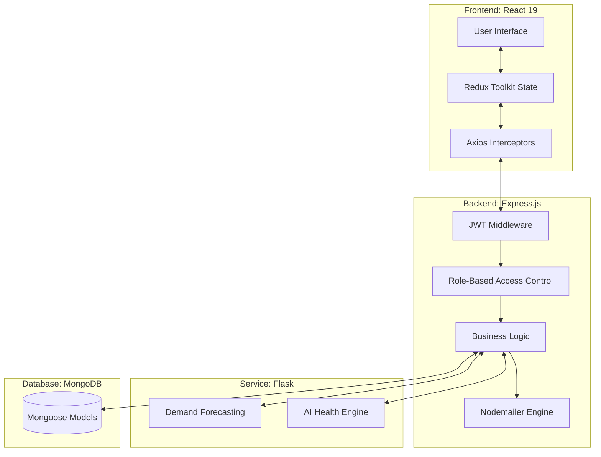

# Drop4Life 🩸 

> **Intelligence meets Humanity.** A state-of-the-art MERN + AI platform designed to eliminate blood shortages through predictive logistics, automated matching, and a seamless multi-tenant medical ecosystem.

[]()
[]()
[]()
[](https://blood-donation-system-vert.vercel.app/)

---

## 📖 Overview

Drop4Life is not just a donation portal; it's a **Blood Supply Chain Management System**. By integrating **Machine Learning** with a robust **Node.js backend**, the platform transforms blood donation from a reactive manual struggle into a proactive, data-driven ecosystem. It supports multiple stakeholders including Donors, Hospitals, Doctors, Lab Testers, and Administrators.

---

## 🌟 Key Features

### 🧠 AI-Driven Intelligence
- **Predictive Demand Forecasting**: Uses Linear Regression (Python/Flask) to analyze historical usage and predict future blood unit requirements for hospitals.
- **AI Eligibility Engine**: Instant health screening for donors based on Hemoglobin (HB), BP, Age, and BMI, featuring simulated **Explainable AI (XAI)** to explain rejection/approval reasons.

### 🏥 Hospital & Inventory Management
- **Atomic Inventory Control**: Real-time tracking of blood bags with atomic updates to prevent double-allocation.
- **Lab Testing Workflow**: Integrated workflow for Lab Testers to record blood test results (HIV, Hep-B, etc.) before units enter the usable inventory.
- **Staff Management**: Hospitals can manage their own internal staff (Doctors, Testers, Receptionists).

### 🩸 Donation Ecosystem
- **Automated Matching**: Algorithmically finds compatible donors for urgent blood requests based on blood group compatibility (e.g., O- can give to anyone).
- **Camp Organization**: Hospitals can organize blood donation camps and donors can view/join them in real-time.
- **Story Sharing**: A social layer where donors share their experiences to inspire the community.

### 🛡️ Enterprise-Grade Security
- **Dynamic RBAC**: Role-Based Access Control with 6+ distinct roles.
- **Secure Auth**: JWT-based authentication with high-entropy secrets and protected routes.

---

## 🛠️ Tech Stack

### Frontend (Client)
| Technology | Version | Purpose |
| :--- | :--- | :--- |
| **React** | 19.2.0 | Core UI Framework |
| **Redux Toolkit** | 2.11.2 | Global State Management |
| **Vite** | 7.2.4 | Build Tool / Dev Server |
| **Tailwind CSS** | 3.4.19 | Modern utility-first styling |
| **Recharts** | 3.7.0 | Data visualization for demand history |
| **Framer Motion** | ^11.x | Smooth UI animations & transitions |

### Backend (Server)
| Technology | Version | Purpose |
| :--- | :--- | :--- |
| **Node.js** | 20.x | Runtime Environment |
| **Express.js** | 5.2.1 | API Framework |
| **MongoDB Atlas** | ^9.1.2 | NoSQL Cloud Database |
| **Mongoose** | 9.1.2 | ODM for MongoDB |
| **JWT** | 9.0.3 | Secure Token-based Authentication |
| **Nodemailer** | 7.0.12 | Automated email notifications |

### AI Service
| Technology | Version | Purpose |
| :--- | :--- | :--- |
| **Python** | 3.10+ | ML Processing |
| **Flask** | 3.0.3 | Micro-service API |
| **NumPy** | 1.26.4 | Numerical data processing |
| **Scikit-Learn** | (Model) | Linear Regression & Forecasting logic |

---

## 🏗️ System Architecture



---

## 📂 Project Structure

```text
├── client/                 # React Frontend
│   ├── src/
│   │   ├── components/     # Reusable UI Components
│   │   ├── pages/          # Page components (Role-specific subfolders)
│   │   ├── store/          # Redux Toolkit Slices
│   │   └── utils/          # API helpers & formatting
├── server/                 # Express Backend
│   ├── src/
│   │   ├── controllers/    # Request handlers
│   │   ├── models/         # Mongoose Schemas
│   │   ├── routes/         # API Endpoints
│   │   ├── middleware/     # Auth & Role guards
│   │   └── config/         # DB & Environment config
├── ai-service/             # Python Flask ML Service
│   ├── app.py              # ML API Endpoints
│   └── requirements.txt    # Python dependencies
```

---

## 🔌 API Reference

### Auth & User
| Method | Endpoint | Description | Access |
| :--- | :--- | :--- | :--- |
| POST | `/api/auth/register` | Register new user | Public |
| POST | `/api/auth/login` | Login and get JWT | Public |
| GET | `/api/auth/me` | Get current user data | Private |

### Hospital & Medical
| Method | Endpoint | Description | Access |
| :--- | :--- | :--- | :--- |
| GET | `/api/hospital/inventory` | View current blood stock | Hospital/Doctor |
| POST | `/api/hospital/inventory` | Add blood units to stock | Hospital |
| POST | `/api/hospital/lab/test` | Submit blood safety results | Lab Tester |
| POST | `/api/hospital/doctor/request` | Request blood for patient | Doctor |
| GET | `/api/hospital/forecast` | Get AI demand prediction | Hospital |

### Donor & Social
| Method | Endpoint | Description | Access |
| :--- | :--- | :--- | :--- |
| POST | `/api/eligibility/check` | Run AI eligibility check | Donor/Public |
| POST | `/api/donor/donate` | Register for blood donation | Donor |
| GET | `/api/stories/all` | View community impact stories | Public |

*(For full list, see [Project_Report.md](./Project_Report/Project_Report.md))*

---

## 🛡️ Role-Based Access Control (RBAC) Matrix

| Feature | Donor | Hospital | Doctor | Lab Tester | Admin |
| :--- | :---: | :---: | :---: | :---: | :---: |
| Donate Blood | ✅ | ❌ | ❌ | ❌ | ❌ |
| View Inventory | ❌ | ✅ | ✅ | ❌ | ✅ |
| Manage Staff | ❌ | ✅ | ❌ | ❌ | ❌ |
| Submit Test Results | ❌ | ✅ | ❌ | ✅ | ❌ |
| Request Blood | ❌ | ✅ | ✅ | ❌ | ❌ |
| Forecast Demand | ❌ | ✅ | ❌ | ❌ | ✅ |
| Delete Users | ❌ | ❌ | ❌ | ❌ | ✅ |

---

## 🚀 Getting Started

### Prerequisites
- Node.js (v18+)
- MongoDB Atlas Account
- Python (v3.10+)
- Git

### 1. Clone the repository
```bash
git clone https://github.com/mdIrfan4019/Blood-Donation-System.git
cd Blood-Donation-System
```

### 2. Setup Server
```bash
cd server
npm install
# Create .env (see Environment Variables section)
npm run dev
```

### 3. Setup AI Service
```bash
cd ai-service
pip install -r requirements.txt
python app.py
```

### 4. Setup Frontend
```bash
cd client
npm install
# Create .env (VITE_API_URL=http://localhost:5000)
npm run dev
```

---

## 🔐 Environment Variables

### Server (`/server/.env`)
```env
PORT=5000
MONGO_URI=your_mongodb_atlas_uri
JWT_SECRET=your_jwt_secret_key
AI_SERVICE_URL=http://localhost:8000
EMAIL_USER=your_email
EMAIL_PASS=your_email_password
```

### Client (`/client/.env`)
```env
VITE_API_URL=http://localhost:5000
VITE_AI_SERVICE_URL=http://localhost:8000
```

---

## 🗺️ Roadmap & Future Scope
- [ ] **GPS Real-time Tracking**: Monitor blood transport vehicles via Google Maps API.
- [ ] **Blockchain Integration**: Immutable ledger for blood bag history (100% transparency).
- [ ] **Mobile Application**: Native React Native apps for iOS/Android.
- [ ] **Advanced AI**: Computer Vision for automated blood bag label scanning.

---

## ❤️ Acknowledgements
This project is dedicated to the voluntary donors who keep the world's pulse beating. 
**Drop a Star ⭐ if you believe in the cause!**

---
© 2026 Drop4Life - Intelligence meets Humanity.
