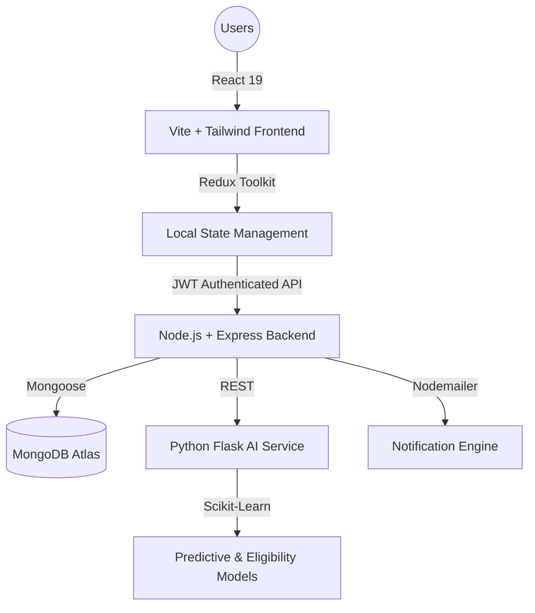

# Drop4Life 🩸 

> **Intelligence meets Humanity.** The state-of-the-art MERN + AI platform designed to eliminate blood shortages through predictive logistics and seamless human connection.

[]()
[]()
[]()
[](https://blood-donation-system-vert.vercel.app/)

---

## 🌟 The Vision
In the time it takes to read this sentence, someone somewhere needs a life-saving blood transfusion. Yet, blood banks often operate reactively—waiting for a crisis before calling for donors. **Drop4Life** flips the script. By integrating **Artificial Intelligence** with a robust **Logistics Network**, we transform blood donation from a manual struggle into a proactive, data-driven ecosystem.

---

## 📖 For the Non-Coder: How it Works
Imagine a world where blood flows exactly where it's needed, minutes *before* an emergency happens. That is the "Drop4Life Journey":

1.  **The Donor (Sam)**: Sam signs up. Our **AI Eligibility Engine** checks his recent health history and medical rules instantly. Sam knows he’s safe to donate before he even leaves his house.
2.  **The Hospital (LifeLine Center)**: Using our **AI Demand Forecast**, the hospital sees that "O-Negative" blood demand usually spikes during the upcoming rainy season. They organize a "Camp" through the platform *now* to prepare.
3.  **The Matching**: A patient needs blood. Our system algorithmically scans the network, finds Sam's donation, and pairs them in seconds.
4.  **The Impact**: Sam receives a notification: *"Your blood was just used to save a life."* The loop of humanity is closed.

---

## 🛠️ For the Recruiter: Technical Architecture
Drop4Life is built as a high-concurrency, multi-tenant system leveraging a distributed microservice architecture.

### High-Level System Architecture


### Key Technical Achievements
-   **Predictive Logistics**: Implemented a Python-based forecasting service using **Linear Regression** to predict hospital blood demand trends.
-   **Atomic Concurrency**: Backend logic ensures that a single blood bag cannot be assigned to multiple patients simultaneously, even under high request volume.
-   **Dynamic RBAC (Role-Based Access Control)**: A sophisticated permission system with **6+ distinct roles** (Admin, Hospital, Doctor, Tester, etc.), each with tailored workspaces and data access levels.
-   **Real-time UI/UX**: Developed a premium "Glassmorphism" interface using **Tailwind CSS**, featuring dark mode support and ultra-responsive layouts for mobile medical environments.

---

## 🎭 The Human Ecosystem (Roles)

| Role | Responsibility | Tech Highlight |
| :--- | :--- | :--- |
| **🧛 Donor** | Contribute blood & track impact. | AI Eligibility Screening |
| **🏥 Hospital Admin** | Manage inventory & organize camps. | AI Demand Forecasting |
| **👨‍⚕️ Doctor** | Register patients & request blood. | Low-latency Search & Filter |
| **🧪 Lab Tester** | Screen blood for safety & type. | Real-time Status Updates |
| **⌨️ Receptionist** | Onboard patients and donors. | Rapid Entry OCR (Planned) |
| **🛡️ Global Admin** | Platform health & system metrics. | Centralized Audit Logs |

---

## 💻 Tech Stack

### Frontend
- **Framework**: React 19 (Vite)
- **State**: Redux Toolkit (Thunk)
- **Styling**: Tailwind CSS (PostCSS)
- **Visuals**: Recharts (Data Viz), Framer Motion (Animations)

### Backend
- **Core**: Node.js & Express.js
- **Database**: MongoDB Atlas
- **Auth**: JWT (JSON Web Tokens) with HttpOnly Cookies
- **Communication**: Axois, Nodemailer

### AI Service
- **Core**: Python 3.x
- **Infrastructure**: Flask
- **ML Engine**: Scikit-Learn, NumPy, Joblib

---

## 🚀 Getting Started

### 1. Clone the repository
```bash
git clone https://github.com/your-username/drop4life.git
```

### 2. Setup Backend
```bash
cd server
npm install
# Create .env with MONGO_URI, JWT_SECRET, PORT, AI_SERVICE_URL
npm run dev
```

### 3. Setup AI Service
```bash
cd ai-service
pip install -r requirements.txt
python app.py
```

### 4. Setup Frontend
```bash
cd client
npm install
# Create .env with VITE_API_URL
npm run dev
```

---

## 🗺️ Roadmap
- [ ] **GPS Logistics**: Real-time tracking for blood transport vehicles.
- [ ] **Blockchain Ledger**: Immutable history of blood bags for 100% transparency.
- [ ] **Mobile App**: Dedicated Android/iOS apps for donors.

---

## ❤️ Acknowledgements
This project is dedicated to the millions of voluntary donors who keep the world's pulse beating. **Drop a Star ⭐ if you believe in the cause!**
