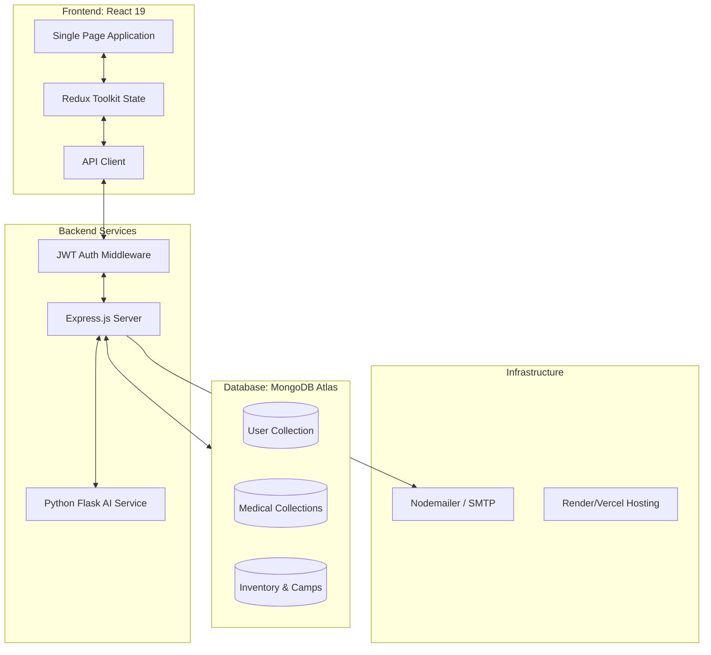
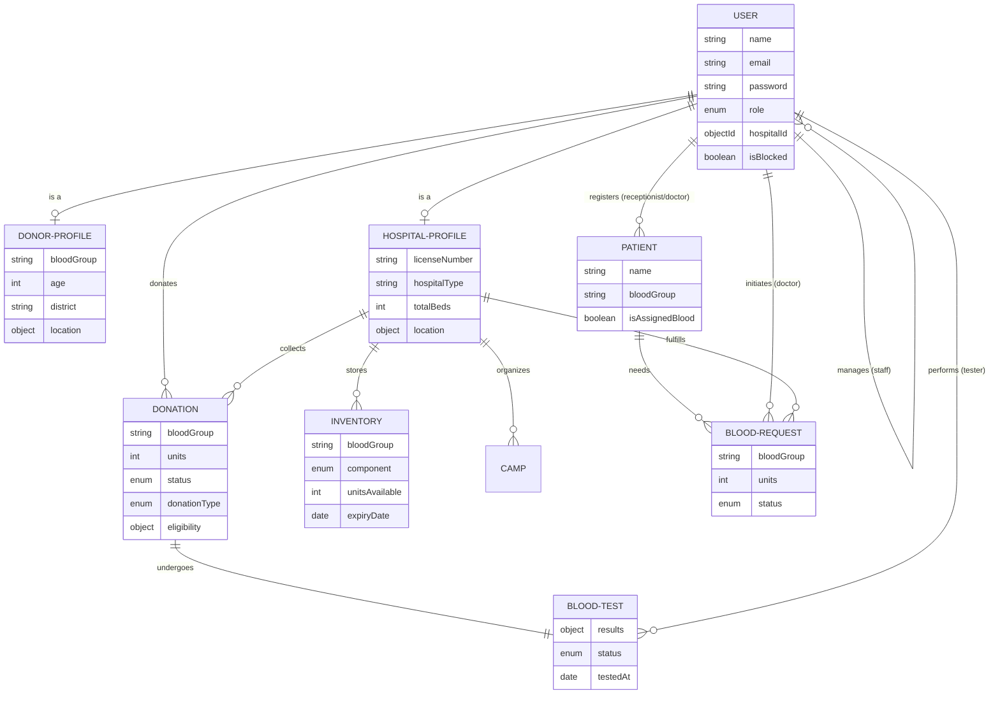
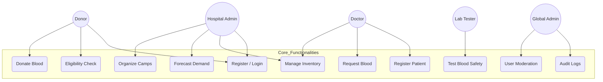

# System Design Documentation - Drop4Life 🩸

This document outlines the technical architecture, data models, and interaction patterns of the Drop4Life Blood Donation Management System.

---

## 🏗️ 1. High-Level System Architecture

Drop4Life follows a **distributed microservice-inspired architecture** with a centralized data store.

### Component Diagram

---

## 📊 2. Entity-Relationship (ER) Diagram

The system uses a NoSQL approach (MongoDB) but maintains strong relational integrity through Mongoose `ObjectId` references.

---

## 🎭 3. Use Case Diagram

This diagram illustrates the primary interactions between different system actors and the platform's core functionalities.

---

## 🔄 4. Core Workflow: Blood Lifecycle

1.  **Donation Phase**: A **Donor** registers for a donation at a **Hospital** or **Camp**.
2.  **Screening Phase**: The **Lab Tester** claims the blood bag and performs a series of safety tests (HIV, Hep-B, etc.).
3.  **Inventory Phase**: If results are `safe`, the system atomically updates the **Inventory** for that hospital, increasing the units for the specific blood group.
4.  **Request Phase**: A **Doctor** registers a **Patient** and submits a **Blood Request**.
5.  **Allocation Phase**: If inventory is available, the request is `approved`, units are deducted from inventory, and the patient is marked as `Assigned`.

---

## 🛡️ 5. Security & Access Design

### Authentication
- **Mechanism**: JSON Web Tokens (JWT) stored in secure HttpOnly cookies (client-side) or local storage with standard headers.
- **Session**: Expiring tokens to minimize hijack risk.

### Authorization (RBAC)
- **Donor**: Read-only access to camps, impact stories. Write access to own profile/donations.
- **Hospital Admin**: Full control over hospital workspace, inventory, and staff onboarding.
- **Doctor/Tester**: Restricted access to specific clinical modules (Patient management / Lab testing).
- **Global Admin**: System-wide bypass for moderation and maintenance.

---
© 2026 Drop4Life | Technical Design Specification
